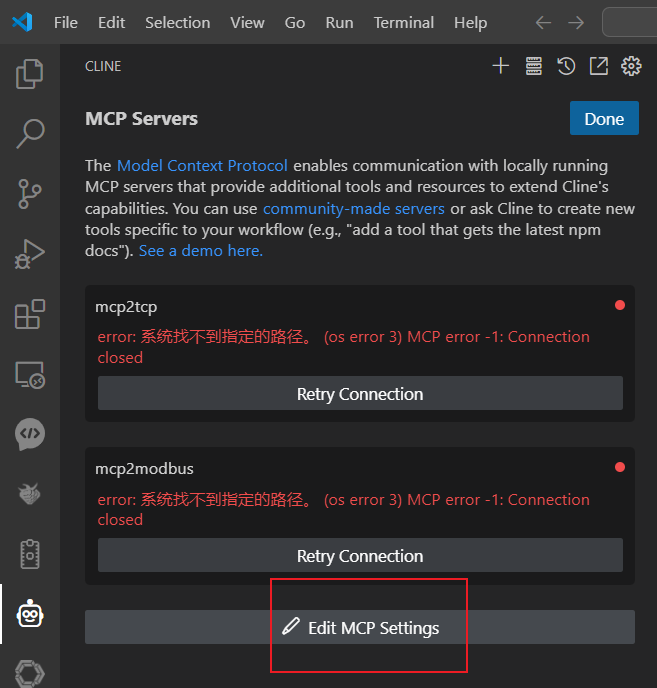
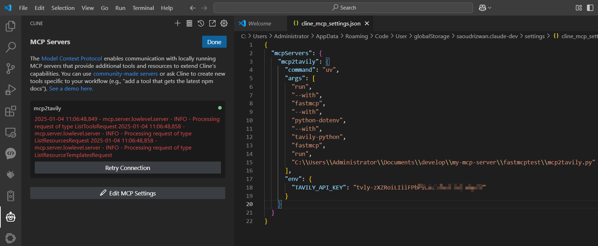
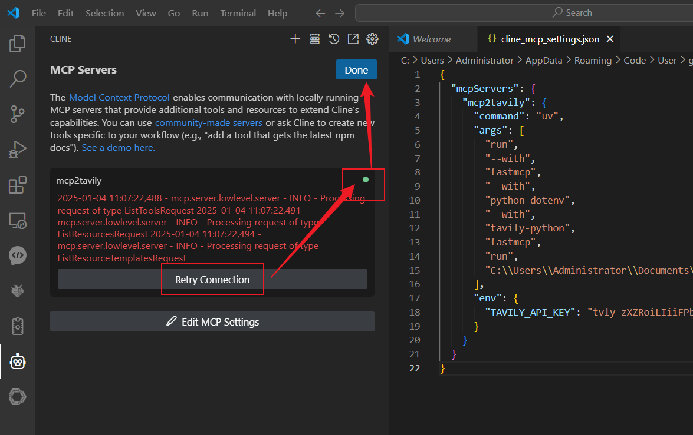
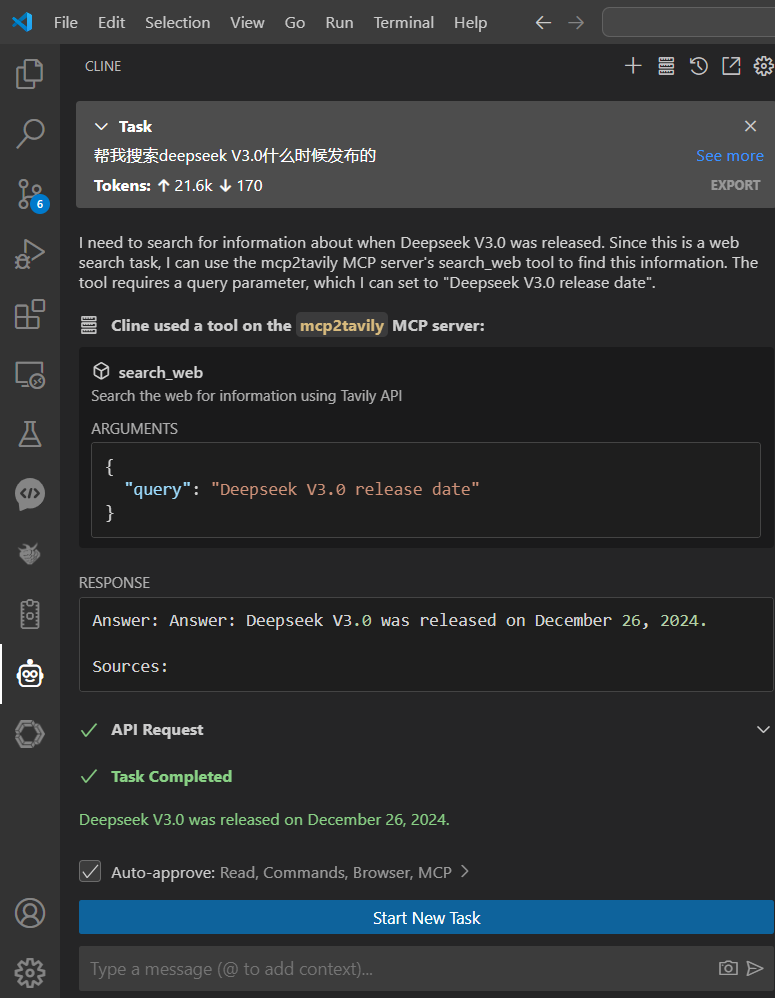

# MCP2Tavily

一个基于MCP协议的服务器，使用Tavily API实现网络搜索功能。

## 系统要求

- Python 3.11+
- UV包管理器
- Tavily API密钥

## 安装步骤

1. 克隆项目
```bash
git clone <仓库地址>
cd mcp2tavily
```

2. 创建并编辑环境变量文件
```bash
# 添加Tavily API密钥到.env文件
.env
```

3. 使用UV创建虚拟环境
```bash
# 创建并激活虚拟环境
uv venv
# Windows系统使用:
.venv\Scripts\activate
# Linux/Mac系统使用:
source .venv/bin/activate
```

4. 安装依赖
```bash
uv sync
```

## 使用方法

### 安装为Claude扩展
```bash
fastmcp install mcp2tavily.py
```

### 开发模式与MCP检查器
要使用MCP检查器测试功能：

```bash
fastmcp dev mcp2tavily.py
```

运行后，可以在浏览器访问MCP检查器：http://localhost:5173

## 可用工具

- `search_web(query: str)`: 使用Tavily API搜索网络
- `search_web_info(query: str)`: 同上，带中文描述

## 环境变量

- `TAVILY_API_KEY`: 你的Tavily API密钥（必需）

## 注意事项

- 确保在使用前已正确设置API密钥
- 虚拟环境激活后才能运行相关命令
- 如遇到编码问题，请确保系统使用UTF-8编码

## 手动添加Cline Continue Claude
打开Cline Continue Claude的MCP服务器配置文件，加入以下信息
```json

"mcp2tavily": {
      "command": "uv",
      "args": [
        "run",
        "--with",
        "fastmcp",
        "--with",
        "python-dotenv",
        "--with",
        "tavily-python",
        "fastmcp",
        "run",
        "C:\\Users\\你的真实路径\\mcp2tavily.py"
      ],
      "env": {
        "TAVILY_API_KEY": "API密钥"
      }
    }
```


## 详细操作步骤
### Cline集成


### Cline集成

### Cline集成


### 使用示例

